Let's start with an example equation for this concept.

Imagine an equation for modeling the perceived temperature, where several variables are responsible for predicting the temperature.

$$z = f(T,H,W)$$

**Where:**

- **Z** is the _perceived temperature_
- **T** is the _temperature_
- **H** is the _humidity_
- **W** is the _wind chill_

But what if the arguments themselves are determined by the other arguments? What if **Humidity** was determined by Temperature and Pressure?

$$z = f(T, H(T,P), W(V,T))$$

**Where:**

- **P** is _pressure_
- **V** is _wind velocity_

This is where the _multivariable chain rule_ would come in handy.

---

## Chain Rule: Case I

Lets make $z$ be defined by two parametric functions $x(t)$ and $y(t)$

$$z = f(x,y) = f(x(t), y(t))$$

> [!Example]
> If $z = x^2 y + 3x^4$, and $x = \sin 2t$, $y = \cos t$, find $\frac{dz}{dt}$

Applying the chain rule:

$$
\frac{dz}{dt} = \frac{\partial f}{\partial x} \frac{dx}{dt} + \frac{{\partial f}}{\partial y} \frac{dy}{dt}
$$

Plugging in the numbers:

$$\frac{dz}{dt} = (2xy + 3y^4)(2\cos_{}2t) - (x^2+12xy^3)(\sin t)$$

Simplifying:

$$= z_{x} \frac{dx}{dt} z_{y} \frac{dy}{dt}$$

---

## Chain Rule: Algorithm

Let's start with a tree diagram( should be familiar as a CS student)

### Tree Diagram

```mermaid
graph TD
    z --> x
    z --> y
    x --> S["𝓈"]
    x --> t["t"]
    y --> s["𝓈"]
    y --> t2["t"]

```

**How do we use this tree diagram?**

Let's take a look at an exmaple:

> [!Example]
> If $W = f(x,y,,z) = x^4 y + y^2z^3$, $x = rse^t$, $y = rs^2e^-t$, $z = r^2s \sin * t$, find $\frac{dW}{dt}$

Applying the tree method:

$$
\frac{dw}{ds} = w_{x}x_
$$
