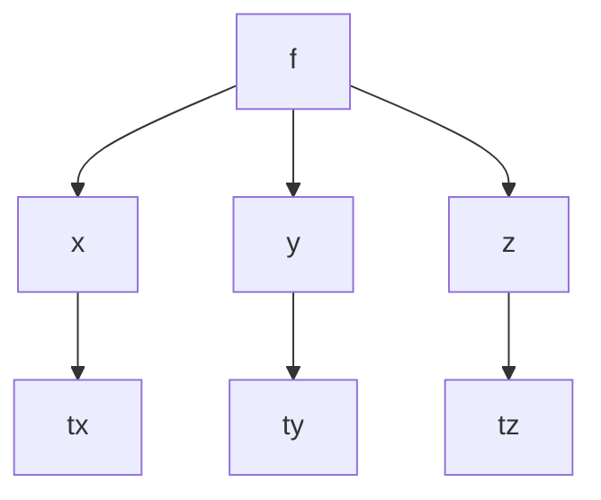

Recall that $\nabla f$ is orthogonal to the level curves/surfaces.

---

## Example

>[!Example]
>
> $$ w = f(x,y,z)$$
>
>-  This function has the level surfaces $f(x,y,z) = K$ where K is constant
> - Let C be **any** curve on the level surface
> - Suppose C is parameterized by some vector function $\vec{r}(t)=\langle x(t), y(t), z(t) \rangle$

If this is the case, then we can say something like:

$$f(x(t),y(t),z(t)) = K$$

We can use the chain rule here to find the $\frac{\partial}{\partial t}$ of both sides

Applying this onto our tree diagram method:

Setting up the equation:

$$f_{x}x_{t}+f_{y}y_{t}+f_{z}z_{t} = 0$$

Putting this in unit vector form:

$$\langle f_{x}, f_{y}, f_{z} \rangle \cdot \langle x'(t), y'(t), z'(t) \rangle = 0$$

Which finally yields the key equation:

### Important Information

>[!Important] Key Formula
>
> $$\nabla f \cdot \vec{r}'(t) = 0$$
>
> Where the key formula is $\sqrt{ IF }$

---

## What This Tells Us

This **key formula** tells us the the **gradient vector**(at any point) is orthogonal to the tangent vector (at the same point) to any curve on the surface passing through that point.

**Result of this action:**
$\nabla f$ is a normal vector for the tangent plane.

For the surface $f(x,y,z) = K$, the tangent plane at the point $(x_{0},y_{0},z_{0})$ is:

$$f_{x}(x_{0},y_{0}, z_{0})(x-x_{0}) + f_{y}(x_{0},y_{0},z_{0})(y-y_{0}) + f_{z}(x_{0},y_{0},z_{0})(z-z_{0}) = 0$$

Which then yields:

$$\nabla f \cdot \nabla r = 0$$

$$\nabla r = \langle \nabla x,\nabla y,\nabla z \rangle = \langle x-x_{0}, y- y_{0}, z-z_{0} \rangle$$

---

## Tangent Line to Curve of Intersection of Surfaces

Find the tangent line to curve of intersection of:

$$z=x^2+y^2 \space \space \space4x^2+y^2 + z^2 = 9 \space at \space(-1,1,2)$$